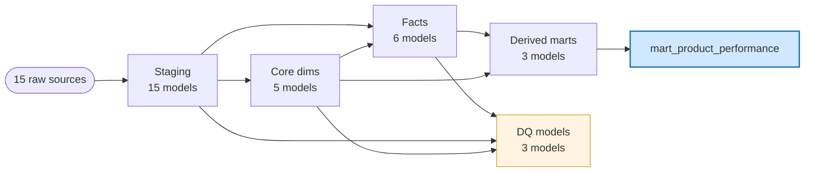

# Hasbro Analytics Engineer Take-Home

A dbt project that turns intentionally messy synthetic consumer-product and supply-chain data into a tested, documented gold layer. **32 models, 70 tests, all passing.**

## Executive Summary

- **Coverage across domains, not depth in one.** Five core dimensions and six facts span product, commercial, supply chain, and marketing — the same pattern handles a sixth domain without code changes.
- **Source-system resolution is auditable.** `dim_product` collapses PLM and ERP records using documented rules (PLM-wins for master, ERP-wins for transactional, hierarchy-wins for curated) with `is_in_*` flags that expose where each value came from.
- **Data quality decisions follow one framework.** Every issue lands in one of five buckets: fix, coerce-and-flag, preserve-and-flag, quarantine, or document. No ad-hoc choices.
- **Orphans are visible, not dropped.** `is_known_*` flags on facts + dedicated `dq_*` models surface every foreign-key and value violation rather than silently filtering.
- **The unified mart finds real problems.** One row per SKU pulls together sell-in, sell-through, inventory, marketing, and purchase orders — surfaces cross-domain issues that are invisible in any single source (prelaunch product with an invalid supplier, overdue PO behind an active stockout, discontinued product still selling through).

## Architecture



Staging stays 1:1 with source — both the PLM and ERP rows for SKU-1001 survive. Resolution happens in the dim layer with documented tiebreakers. That separation keeps the lineage auditable: anyone can ask "where did this attribute come from?" and answer it from the dim's provenance flags.

## Key findings

**Ocean Orbit Builder (SKU-1007) — prelaunch with a broken supply chain.** Zero on-hand, 900 units in transit, a 300-unit open order from a strategic customer, prelaunch marketing live with $1,100 spent. Normal so far. The interesting part: the next-batch PO (PO-5006, 900 units) is open against supplier `SUP-404` — which doesn't exist in the supplier master. Somebody approved a 900-unit PO to an unrecognized vendor. Each system in isolation looks fine. Combined, the problem is obvious.

**Color Cloud Studio (SKU-1004) — stockout with overdue PO.** Current on-hand = 0. The replenishment PO (PO-5004, 1,200 units from Delta Plastics, requested April 25 2024) is still open with zero received. Meanwhile $1,500 of marketing continues to drive demand the supply chain can't fulfill.

**Robo River Racer (SKU-1005) — overselling at WH-001.** Inventory snapshot shows `on_hand = -25`, `available = -75`. `has_negative_on_hand_flag` and `is_oversold` both fire. POS data still shows positive sell-through. Supply chain needs to investigate.

**Garden Quest Card Game (SKU-1006) — discontinued but still selling.** Lifecycle status is discontinued as of January 2024, but POS data shows 10 units still moving in April. Either residual channel inventory liquidating, or the discontinuation was premature. The discrepancy is invisible without unifying sell-in and sell-through in the same view.

## Approach

I prioritized demonstrating a *pattern* that scales over polishing one domain perfectly. The hiring conversation focused on a gold layer that supports decentralized franchise analytics — that thesis is best shown by consistent standardization, dedup, testing, and DQ surfacing applied across all major data domains.

The single most consequential architectural choice was where system-of-record resolution lives. Staging mirrors source 1:1, no dedup, no FK validation. The dim layer resolves duplicates with documented deterministic tiebreakers and exposes provenance via `is_in_*` flags. That separation means the *moment of resolution* is visible — analysts can trace any attribute back to its source system.

## Standardization

`taxonomy_lookup_raw` provides canonical mappings for SKUs, channels, regions, countries, platforms, suppliers, statuses, and units of measure. Every staging model joins to `stg_taxonomy_lookup` for its relevant mappings.

The source taxonomy is incomplete. During the build I found four real gaps: `sku1007` (lowercase prefix used in hierarchy), `United States` and `Poland` (country names rather than ISO codes), and `Europe` (used interchangeably with `EMEA`). Rather than hardcoding fixes into individual models, I extended `stg_taxonomy_lookup` with a `discovered_gaps` block and a `mapping_source` column ('source_taxonomy' vs 'discovered_gap'). Downstream behavior is identical; the provenance column makes the workarounds visible to the data governance team for upstream promotion.

One honest call: the `Europe → EMEA` mapping is an assumption. Europe is a continent, EMEA is a business region. Only European countries appear in this dataset, so I treated them as equivalent for normalization. In production, a regional-ops conversation would confirm or refine this.

## Data quality framework

| Bucket | Rule | Example |
|---|---|---|
| Fix silently | Pure type/format issues with no business meaning | Whitespace, case, date format unification |
| Coerce + flag | Type-invalid but row matters | `'abc'` ordered_units → NULL, row keeps `fulfillment_status='units_unknown'` |
| Preserve + flag | Valid but unusual; carries business signal | Negative inventory, negative POS (returns), negative clicks |
| Quarantine | Orphan FKs — row preserved, FK marked unknown | SO-10007 → CUST-007, PO-5006 → SUP-404 |
| Document | Can't fix without external data | Multi-currency without an FX dim |
| Flag, don't resolve | Ambiguous — needs human decision | SCD2 overlap on SKU-1001 hierarchy |

## Testing

70 tests, all passing. Focused on what proves the gold-layer thesis rather than counting coverage:

- `unique` + `not_null` on every dim PK proves deduplication worked.
- `relationships` on every fact-to-dim FK, **scoped to `is_known_*=1`**. Without the scoping, tests would fail on orphans we deliberately preserved. With it, the test asserts "for every row where I claim the FK is known, the FK exists in the dim." Orphans are visible through DQ models — two surfaces for two questions.
- `accepted_values` on every status enum and boolean flag confirms standardization holds.

A production version would add custom tests on safe-cast nullification, date monotonicity within shipment events, and inventory balance reconciliation.

## Tradeoffs and assumptions

- **No `dbt_utils`, no surrogate keys, no incremental, no snapshots.** The community SQLite adapter has compatibility quirks with `dbt_utils`. At Hasbro's scale I'd use `dbt_utils.generate_surrogate_key` for join performance, add `materialized='incremental'` with `strategy='merge'` on high-volume facts (inventory, POS, marketing), and use `dbt snapshot` on `stg_products` for real Type 2 history rather than relying on the source's existing-but-broken effective dates.
- **System-of-record rule for products** — PLM wins for master, ERP wins for transactional, hierarchy wins for curated standardized attributes. Standard CPG pattern; the `is_in_*` flags keep resolution auditable per row.
- **Dedup tiebreakers** are deterministic proxies (shorter country code wins, non-NULL critical fields beat null, IANA timezones beat short codes, alphabetical name as final tiebreaker). In production I'd push back upstream to add `updated_at` and use latest-wins.
- **Multi-currency stays as-is.** USD/CAD/GBP coexist; converting requires an FX rate source we don't have. Money fields carry their `currency` column; the unified mart's `total_marketing_spend` is not valid across currencies without conversion. Called out as a limitation rather than silently summed.
- **Weeks-of-supply uses simple average velocity** across all observed POS weeks. Trailing 8 or 13 weeks would be better; the dataset has too little history for trailing logic to be meaningful.

## What I'd improve next

In order of impact:

- **Taxonomy as a versioned dbt seed CSV** — reference data belongs in git with PR review. The `discovered_gaps` entries become tracked changes.
- **Refactor safe-cast logic into a shared `safe_numeric()` macro** — same pattern repeats across most staging models.
- **`dim_campaign` and `dim_date`** — both simplify the unified mart and enable proper time-series.
- **Currency conversion via `dim_fx_rate`** with effective dates and a conformed conversion CTE.
- **`dq_*` models as scheduled monitoring** rather than persistent views, with thresholds routing alerts by domain ownership (orphan FK spikes to data eng, SCD2 overlaps to data steward, negative inventory to supply chain ops).
- **Daily `fct_inventory_position_daily` snapshot** with carryforward logic so weeks-of-supply can use trailing windows.
- **Custom tests on safe-cast outputs** to assert nullification was triggered on the right rows, not just that the resulting enum is bounded.

## How to run

Prereqs: Python 3.9+.

```bash
git clone https://github.com/MatuteCorp95/hasbro-analytics-takehome.git
cd hasbro-analytics-takehome
python -m venv .venv && .venv\Scripts\Activate.ps1   # macOS/Linux: source .venv/bin/activate
pip install dbt-core dbt-sqlite
dbt debug && dbt run && dbt test && dbt docs generate && dbt docs serve
```

`profiles.example.yml` shows the SQLite profile template. The database is committed under `data/` for reproducibility; in a real project it would be built by a script.
